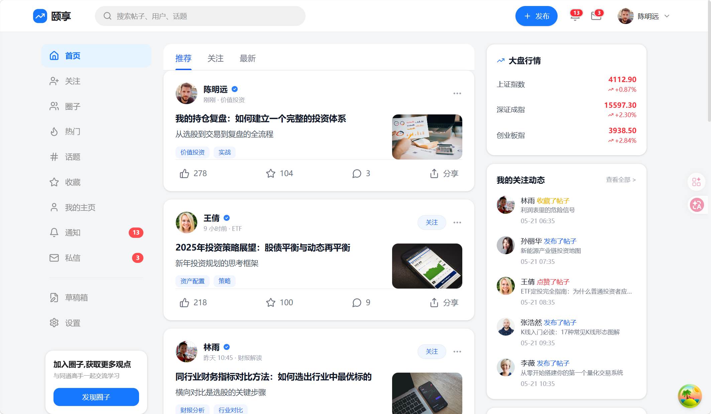
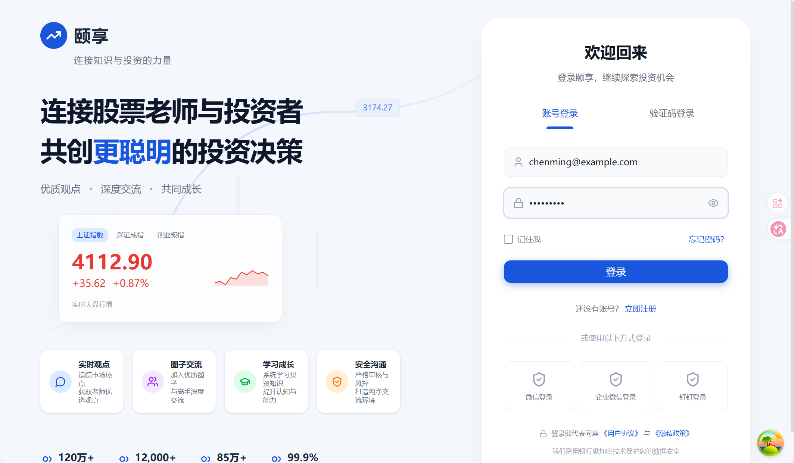
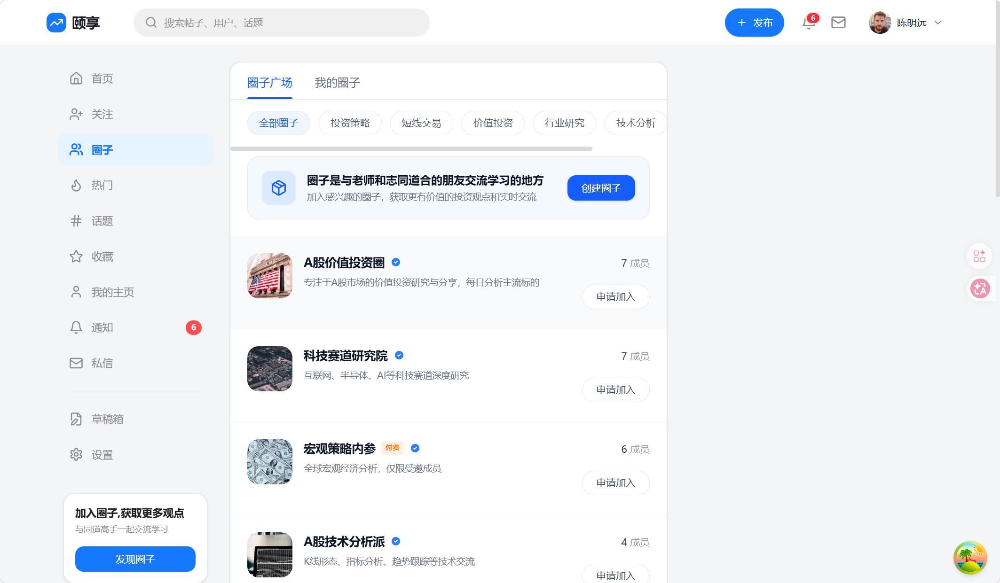

# 颐享 (YiXiang) — 知识分享社区


颐享是一个知识分享社区平台，围绕「圈子」构建垂直兴趣社区，支持图文发帖、评论互动、关注关系链、全文搜索与 AI 智能问答。后端基于 Spring Boot 事件驱动架构，通过 Outbox + Canal + Kafka 保证分布式数据一致性；Redis + Lua 实现高性能互动计数；三级缓存 + 热点检测应对高并发信息流读取。

## 页面预览

<table>
  <tr>
    <td align="center"><b>首页信息流</b></td>
    <td align="center"><b>登录</b></td>
    <td align="center"><b>圈子广场</b></td>
  </tr>
  <tr>
    <td></td>
    <td></td>
    <td></td>
  </tr>
</table>

## 功能概览

### 已实现

| 模块 | 功能 |
|------|------|
| **用户系统** | 注册/登录、JWT 双令牌认证（RS256）、个人主页、头像上传、标签管理、访客统计 |
| **内容发布** | 富文本发帖（Markdown）、草稿箱、图片/视频上传（OSS 预签名直传）、圈子选择 |
| **社交互动** | 点赞/收藏（Redis + Lua 原子操作）、评论、关注/取关 |
| **信息流** | 首页 Feed（推荐/关注/热门）、三级缓存（Caffeine → Redis 页面 → Redis 片段）、热点检测 |
| **圈子** | 创建圈子、加入/退出、圈子主页（帖子/成员/问答/精华/文件）、圈子广场搜索 |
| **搜索** | 全文检索（帖子/用户/话题/圈子）、search_after 游标分页、热门搜索 |
| **私信** | 一对一私信、会话列表、实时消息 |
| **通知** | 点赞/评论/关注通知、未读计数 |
| **收藏** | 收藏夹管理、分类筛选 |
| **AI 问答** | 基于 RAG 的文档问答、SSE 流式生成、向量检索 |
| **数据一致性** | Outbox + Canal + Kafka 事件驱动、BitMap 幂等防重、Kafka 异常回放补偿 |

### 待实现（欢迎贡献）

| 模块 | 说明 |
|------|------|
| **管理后台** | 用户管理、内容审核、数据统计 Dashboard、运营配置等后台管理系统 |
| **移动端 App** | iOS / Android 客户端（React Native / Flutter / 原生均可） |

> 如果你对管理后台或移动端开发感兴趣，欢迎提交 PR 或 Issue 讨论方案。

## 技术栈

| 层级 | 技术 |
|------|------|
| **后端框架** | Java 21, Spring Boot 3.2, Spring Security, MyBatis |
| **数据存储** | MySQL 8.0, Redis 7（Redisson + Lua 脚本）, Elasticsearch 9.x |
| **消息中间件** | Kafka 3.x, Canal（MySQL Binlog 订阅） |
| **缓存** | Caffeine（本地）+ Redis（分布式）三级缓存 |
| **AI** | Spring AI 1.0.3 + DeepSeek + OpenAI Embedding + RAG |
| **对象存储** | 阿里云 OSS（预签名 URL 直传） |
| **前端** | React 18, TypeScript 5, Vite 5, Tailwind CSS v4, shadcn/ui, TanStack Query v5, React Router v6 |

### 后端模块

```
com.tongji
├── auth/        认证授权（JWT 双令牌、验证码）
├── cache/       三级缓存 + 热点检测 + 单飞锁
├── common/      全局异常处理、错误码
├── config/      基础设施配置（ES、Redis、线程池）
├── counter/     点赞/收藏计数器（Redis SDS + BitMap + Kafka 聚合）
├── knowpost/    帖子 CRUD + 发布流程（草稿 → 审核 → 发布）
├── llm/         RAG 管线（向量检索 → 提示构建 → SSE 流式生成）
├── profile/     用户主页、头像、标签
├── relation/    关注/取关（Outbox + Canal + Kafka 事件驱动）
├── search/      ES 全文搜索 + 索引管理
├── storage/     OSS 预签名上传
└── user/        用户领域模型
```

## 项目结构

```
yixiang/
├── yixiang_be/             后端 — Spring Boot
│   ├── src/main/java/com/tongji/
│   ├── src/main/resources/
│   │   ├── mapper/         MyBatis XML 映射
│   │   ├── keys/           JWT 密钥（public.pem 公开，private.pem 本地）
│   │   └── application.yml.example  配置模板
│   └── db/
│       ├── schema.sql      数据库建表
│       ├── migrations/     迁移脚本
│       └── seed_*.sql      测试数据
├── yixiang-web/            前端 — React + TypeScript
│   └── src/
│       ├── pages/          16 个页面
│       ├── components/     UI 组件（layout / ui / common）
│       ├── features/       业务 Hooks（TanStack Query）
│       ├── services/       API 客户端
│       └── lib/            工具函数
└── docs/                   设计文档与计划
```

## 快速启动

### 环境要求

- JDK 21+, Node.js 18+
- MySQL 8.0, Redis 7.x, Elasticsearch 9.x, Kafka 3.x

### 后端

```bash
cd yixiang_be

# 1. 复制配置模板并填入你的数据库/Redis/ES 信息
cp src/main/resources/application.yml.example src/main/resources/application.yml

# 2. 生成 JWT 密钥对
mkdir -p src/main/resources/keys
openssl genpkey -algorithm RSA -pkeyopt rsa_keygen_bits:2048 \
  -out src/main/resources/keys/private.pem
openssl rsa -pubout -in src/main/resources/keys/private.pem \
  -out src/main/resources/keys/public.pem

# 3. 初始化数据库
# 执行 db/schema.sql 和 db/migrations/ 中的迁移脚本

# 4. 启动
mvn spring-boot:run
```

### 前端

```bash
cd yixiang-web
npm install
npm run dev        # 开发服务器 :5173，自动代理 /api → :8080
```

## 贡献指南

欢迎任何形式的贡献，特别是以下方向：

- **管理后台** — 基于 React 的后台管理系统（用户管理、内容审核、数据统计）
- **移动端** — iOS / Android App（React Native、Flutter 或原生）
- **功能增强** — Bug 修复、性能优化、新功能提案
- **文档** — 完善技术文档、API 文档

贡献前建议先开 Issue 讨论，避免重复工作。

## License

MIT — 详见 [LICENSE](LICENSE) 文件。
